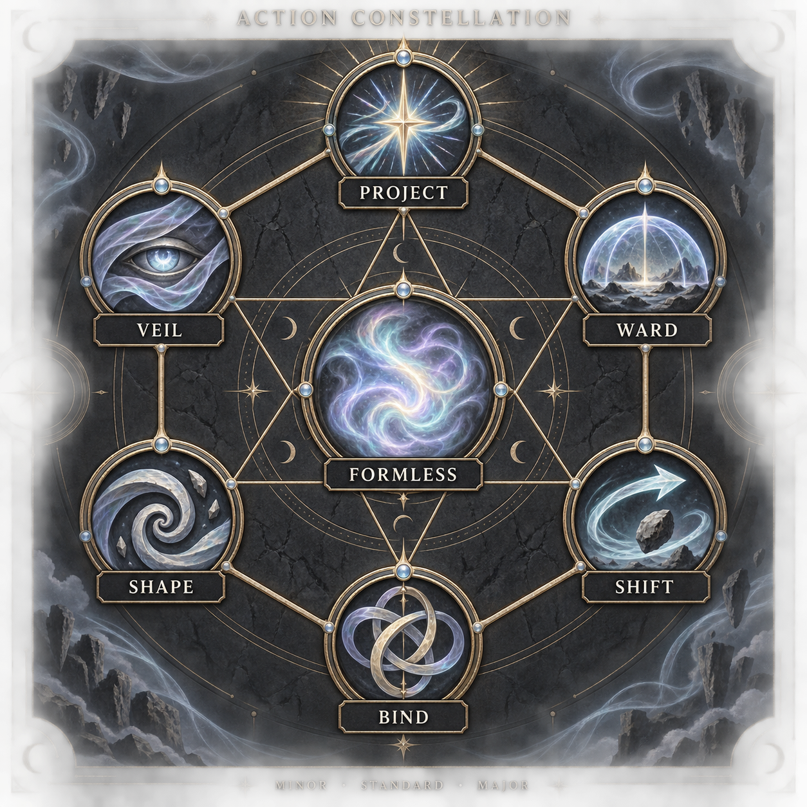

# Arcana Deck — battle module design

**Status:** working design, untested · **Revised:** 2026-09-25  
**Owns:** card actions, random draws, combos, rank access, daily allowance, HP, and module overrides. Working title.

## 1. Established direction

- Original cards use six outer action types and a central **Formless** type. Every card has a **Minor, Standard, or Major rank**.
- Draw cards **randomly from a deck**. Drawing one card spends **either a Minor Action or a Major Action**.
- **Three active cards maximum**, across all Domains. A full spread blocks further draws.
- Minor cards can use **either action**. Standard and Major cards use the Major Action. Card rank and action type are separate.
- **Roll only when the outcome is uncertain.** Drawing or playing a card does not itself require a check.
- Starting trial allowance: **seven draws per in-world day**. PP increases this allowance and unlocks higher ranks per Domain.
- Each Domain starts with **Minor-rank cards only**. Characters retain one Major Action and one Minor Action per cycle.
- Characters start at **5/5 HP**. **One hit deals 1 damage. Strain is removed entirely from this module.** Cards do not cost HP.

The six type names, exact deck contents, reset procedure, healing conversion, and PP prices below remain design proposals. Confirmed mechanics above govern them.

## 2. The action constellation

Six vertices form a **hexagon**, with a hexagram connecting them and **Formless** at the center. Lines identify the types; they do not restrict combinations.

[Plain diagram](constellation.svg) · [Generic card art sheet](art/card-sheet-generic-blue.png) · [Art prompts and provenance](art-prompts.md)

| Type | Permitted form | Boundary |
|---|---|---|
| **Project** | Send the Domain's medium outward. | No extra reach or unrelated medium. |
| **Ward** | Interpose protection. | Stops only threats its manifestation can plausibly stop. |
| **Shift** | Move or redirect an affected object or medium. | No automatic teleportation or unrelated control. |
| **Bind** | Hold, tether, or hinder. | No mind control or guaranteed restraint. |
| **Shape** | Form or reshape the Domain's medium. | Creation requires permission in the Domain's scope. |
| **Veil** | Conceal or obscure. | No automatic invisibility or illusion. |
| **Formless** | Choose one eligible outer-type effect from its Domain's catalog when played. | Keeps its defined rank and Domain; counts as one card and one effect. |

**Recommendation: shared types, ranks, and artwork, defined decks per Domain.** This keeps one rules language while giving each Domain named cards and effects that actually fit its scope. A central deck would require interpreting every draw through a Domain during play. The recommendation is the implementation used below pending the user's choice; generic artwork supports either structure.

The reusable artwork displays the **card type and generic action symbolism**, with a blank **rank** panel at the top and a blank **Domain** panel at the bottom. Art represents the action itself and is shared across Domains. Domain, rank, card name, effect, and limit remain part of each card's mechanical definition in [Domain Decks](domain-decks.md), which owns the proposed Wind and Fire decks. Domain rank access controls which cards enter that Domain's draw pile; players cannot choose the next card.

## 3. Cards, actions, and uncertainty

| Operation | Action cost |
|---|---|
| Draw **one** random card | Minor **or** Major Action. |
| Play a Minor-rank card | Minor **or** Major Action. |
| Play a Standard-rank card | Major Action. |
| Play a Major-rank card | Major Action. |

An action pays for **one draw or one card play**, not both. Spending a Major Action on a Minor card does not increase its rank, scope, damage, or number of effects. Spending a Major Action to draw still draws only one card.

An attack uses the Major Action, even when an eligible Minor card enables it indirectly. A Minor card cannot produce a Standard-scale magical attack simply because the Major Action was spent. Its printed effect and the [VBG scale definitions](../../rules/player-rulebook.md#5-use-abilities) still govern its reach and scope.

**Uncertainty is the only roll trigger.** If the declared result is certain and within the card's limits, it happens after paying the card and action cost. If impossible, it cannot be attempted as stated. If uncertain, identify what is uncertain, state the stakes/TN, and use [VBG resolution](../../rules/player-rulebook.md#2-core-resolution). An unwilling target often creates uncertainty, but does not automatically require a roll when the outcome is already certain.

- Lighting an exposed dry wick with an appropriate fire card: no roll.
- Sending that flame at a moving defender: roll for uncertain aim or resistance.
- Drawing a card: shuffle and reveal; no ability check. Random selection is not a success/failure roll.
- A combo whose components and result are certain: no roll merely because two cards were used.

Costs still apply on a failed attempt. Ordinary actions remain available without cards. Only Domain abilities require their cards; the proposed deck restriction also applies outside battle.

## 4. Combinations and turn choices

| Action pair | Legal use |
|---|---|
| Play Minor + play Minor | Yes: one card spends each action. |
| Play Minor + play Standard/Major | Yes: the Minor card uses the Minor Action. |
| Play two Standard/Major cards | No: both require the one Major Action. |
| Draw + play Minor | Yes: assign one operation to each action. |
| Draw + play Standard/Major | Yes: draw uses the Minor Action. |
| Draw + draw | Yes: two reveals, two daily draws, and two empty slots required. |
| Play three cards | No: three active slots do not grant a third action. |

A combo consists of two cards played toward a combined objective. Each retains its own rank and limits. Two Minor cards do not become a Standard card. Combining gives no automatic bonus, extra damage, or guaranteed success.

**Minor Shift (Wind) + Major Project (Fire):** tip a small oil vessel onto an empty patch of floor, then send flame through the spill. The setup remains small; the fire card permits the wider manifestation. Catching an enemy requires a roll only if the outcome is uncertain.

**Minor Shape + Minor Project (Wind):** form a tiny guiding current and send a puff through it to carry a light token through a narrow opening. One card uses each action. This is still a small effect, and a clear, unopposed opening needs no roll.

Resolve a combined uncertain objective with one appropriate roll. Independent uncertain objectives may need separate rolls; two cards alone never determine the roll count. Different Domains can contribute if their owner has the required rank access in each.

A combo spends both actions, leaving none for drawing or a conditional response. Sustained effects consume their matching action each later cycle under [VBG's sustaining rules](../../rules/player-rulebook.md#5-use-abilities). **Proposal:** if a Minor card was played using the Major Action, sustaining that particular effect continues to use the Major Action. Ending it frees its card slot, not a previously spent action.

## 5. Random draws, slots, and daily allowance

Three independent quantities:

| Quantity | Starting value / owner |
|---|---|
| Daily draw allowance | **7 reveals total across all owned Domains**. |
| Active spread | **0–3 cards total**, including cards sustaining effects. |
| Deck contents | Defined per Domain in [Domain Decks](domain-decks.md); not the daily allowance. |

**Proposed physical procedure:** choose an owned Domain's face-down draw pile, spend an available action and one daily draw, then reveal its top card into an empty slot. Shuffle eligible cards before use. Draw without replacement; spent cards go to that Domain's discard pile. No searching, choosing a rank, looking ahead, or free redraw for an unwanted result.

When that draw pile is empty, shuffle its discarded cards to make a new pile. Active cards stay out. If no cards are available, that pile cannot be drawn from. Reshuffling never replenishes daily allowance or costs a second action. Choosing another Domain changes the pile, not the shared limits.

**Consumption proposal:** an instant card is spent after its attempt, including failure. A sustained card remains active until its effect ends, then is spent. A card's Domain is fixed. Discarding an unwanted held card is a Free Action with no effect; it frees a slot but refunds neither the draw nor its action cost.

Check the cap **at the moment of drawing**. If all three slots are occupied, first resolve a card play or discard. An unresolved promise to use a card does not make space. Merely playing a previously drawn card does not consume another daily draw.

**No free opening hand or automatic refill.** Every opening or replacement card costs an action and counts toward the daily seven. Cards may be prepared before combat where the fiction allows; record the time and draws spent. Outside an active scene, drawing still takes a deliberate action's worth of time, but does not create artificial combat cycles.

**Asynchronous draw-and-play proposal:** declare which action draws, reveal the card, then let the player specify how the remaining action is used. This is a follow-up within the same cycle, not another turn. Do not resolve the cycle's threats twice or restore spent actions. If follow-up is impractical, the player may state a conditional plan based on the revealed card or hold it for next cycle. Ordinary movement and threat resolution retain their normal place; only the dependent draw/play order is resolved sequentially.

**Example:** with one held card and six draws left, spend the Minor Action to draw from Wind. Five draws remain and two cards are active. If the result is Minor, play it with the Major Action, retaining its Minor scope. If the result is Standard and unlocked, it can also use that Major Action. There is no action left for a third operation.

**Reset proposal:** at the shared in-world dawn, end card-sustained effects, return held and discarded cards, rebuild/shuffle each eligible Domain deck, and reset the daily allowance. Unused draws do not accumulate. Mundane consequences remain. Rest, encounter changes, and real-world posting days do not grant draws. PP rank upgrades take effect when decks are rebuilt at the next reset.

## 6. Domain access and progression

Each Domain starts at **Minor**. PP unlocks **Standard**, then **Major**, for that Domain. New Domains also start at Minor. Higher access adds stronger cards without removing Minor cards. An upgrade never changes an already drawn card.

Trial prices and caps are **proposals, not balanced values**:

| Upgrade | PP | Limit |
|---|---:|---|
| +1 daily draw | 10 | Start at 7; trial maximum 14. Applies next reset. |
| One Domain: Minor → Standard | 10 | Adds that Domain's Standard cards next reset. |
| One Domain: Standard → Major | 20 | Requires Standard; adds Major cards next reset. |
| +1 maximum HP | 10 | Trial maximum 10 HP; replaces the maximum-Strain upgrade. Raises capacity, not current HP. |

Other purchases remain with [Player Rulebook §8](../../rules/player-rulebook.md#8-progression). Acquiring another Domain grants another defined deck, not extra daily draws, active slots, or actions.

Suggested sheet: `HP 5/5 · Draws 7/day, 3 used · Active 2/3 · Wind: Standard · Fire: Minor`.

## 7. HP replaces Strain

**Start with 5 maximum HP and 5 current HP. Remove Strain from the sheet.** Ability activation uses cards and actions, with no HP, Strain, or Charge activation payment. Running out of cards does not harm or Down a character.

**One hit deals exactly 1 damage.** Armor absorbs qualifying damage first using its existing boxes; each remaining damage removes 1 HP. Card rank, combos, weapons, and critical results never raise damage per hit. Creatures keep their existing Resistance track. HP is the player health track.

At **0 HP**, use the existing Downed, Injury, stabilization, and death procedures in [Player Rulebook §6](../../rules/player-rulebook.md#6-harm-and-recovery), substituting HP for the health references. HP does not go negative. Stabilization alone leaves the character at 0 HP with the same action restrictions. Restoring at least 1 HP ends Downed; it does not remove an Injury. Further hits and treatment deadlines retain the existing rules; 0 HP is not automatic death.

**Proposed conversion for supporting rules:**

| Existing rule | Module treatment |
|---|---|
| Catch Your Breath | Restore 1 HP after a threat ends, once per scene. |
| Full Rest | Restore all HP after roughly eight safe hours; Injuries remain. |
| Medical aid | Listed Strain restoration becomes the same amount of HP restoration, retaining charges, targeting restrictions, and per-scene limits. Cap at maximum HP. |
| Stimulant drawback | Its next-scene maximum-Strain penalty becomes a maximum-HP penalty of the same size; clamp current HP to the temporary maximum. Expiry restores capacity, not lost HP. |
| Damage formerly deducted from Strain | Deduct from HP after applicable Armor. Apply the same harm limits. |
| Success-with-Cost or failure consequence | Use a fitting narrative consequence, resource loss, or actual injury/harm. There is no generic fatigue pool or automatic HP tax for casting. If a consequence is a hit, it still deals 1 damage and uses Armor normally. |
| Strain-based activation costs | Remove them; do not relabel them as HP costs. |
| Strain Transfer | Remove the old ability procedure; use the healing-card proposal below. |

**Healing-card proposal:** only a Domain explicitly approved to heal living bodies can have healing cards. A Standard healing card restores **1 HP** to one willing creature in reach; a Major healing card restores **2 HP** to one willing creature in reach. Either spends a Major Action and the card, with no donor HP payment. Minor cards may support treatment but restore no HP. No roll unless circumstances make treatment uncertain. Healing is instant, capped at maximum HP, never removes an Injury by itself, and cannot be sustained for repeated recovery. Wind and Fire decks do not gain healing through Formless.

These conversions are module-local. [Item Glossary](../../rules/item-glossary.md) still owns item quantities and treatment requirements; [GM Guide](../../rules/gm-guide.md) owns adjudication. Effects whose meaning depends on a shared health-and-magic pool need a written adapter before use, not an automatic new HP cost.

## 8. Rule authority and overrides

This module does not edit the VBG 2.2 baseline. The [comparison record](../../docs/baseline-comparison.md#arcana-deck--proposed-vbg-22-overrides) summarizes these changes; this document owns them.

| Baseline owner | Module override |
|---|---|
| Player Rulebook §2 | Roll only for uncertainty; affecting another creature is not an independent mandatory roll trigger. |
| Player Rulebook §§3, 5 | Defined, randomly drawn cards gate Domain powers; per-Domain rank access starts at Minor. |
| Player Rulebook §§4–5 | Minor card play or a single draw can spend either action; Standard/Major play spends the Major Action. Use §§4–5 for combo and draw/play sequencing. |
| Player Rulebook §§3, 5–6 | Remove Strain and activation payments; start at 5 HP. Use §7 for health, recovery, and healing conversions. |
| Player Rulebook §8 | Add draw/rank upgrades; replace maximum-Strain progression with maximum-HP progression. |
| Item Glossary §§4–5; imported harm references | Convert health restoration, penalties, and damage destinations as specified in §7. |

Other mechanics remain with their [VBG 2.2 owners](../../rules/README.md#3-rule-authority): normal action counts, resolution outcomes, Domain scope, default reach, conditions, Armor, and creature Resistance. Existing instructions to roll for a card effect, attack, or hazard are subject to this module's uncertainty rule. A damaging hazard still follows the baseline per-cycle damage and overlap limits.

The [Charge Combat Module](../charge-combat/README.md) is a separate resource package; this module uses neither Charge nor Strain. Combining its movement layer needs an explicit adapter.

## 9. Remaining playtest decisions

- Confirm the recommendation of defined Domain decks with shared types, versus one central deck.
- Test card distributions and effects in [Domain Decks](domain-decks.md), especially useful Minor combos and sustaining action costs.
- Test the daily reset, PP prices, HP recovery, and healing values against expected encounters.
- Verify that staged draw-and-play posts fit the group's asynchronous pace.
