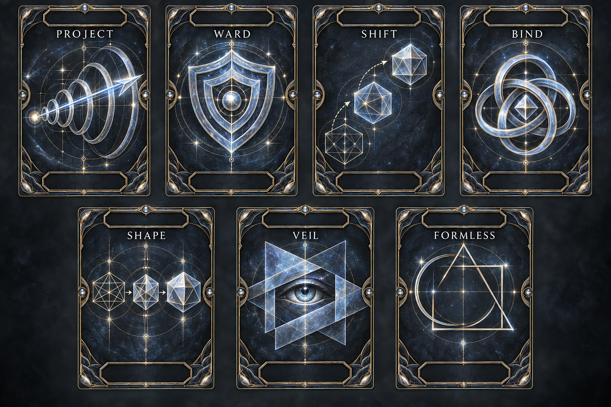

# Arcana Deck — Domain decks

**Status:** proposed catalogs, untested · **Revised:** 2026-09-25  
**Owns:** Domain deck composition, card names, printed effects, and limits. [Module rules](README.md) own actions, uncertainty, draws, HP, and progression.

## 1. Shared construction

The proposed system uses one defined deck per Domain, sharing the same seven types and three ranks. Each cell in the catalogs below is **one distinct card**, including one Formless at each rank. Reusable card art shows the type title and generic action symbolism; use its empty **top panel** for the rank and its empty **bottom panel** for the Domain. The catalog defines each card's Domain, rank, name, effect, and limit for play and deck construction.

| Domain access | Eligible physical cards | Composition at a fresh shuffle |
|---|---:|---|
| Minor | 7 | One of each type, all Minor. |
| Standard | 14 | The seven Minor cards plus seven Standard cards. |
| Major | 21 | All seven types at all three ranks. |

At a fresh shuffle every eligible card has equal probability. Rank chances are 100% Minor at starting access, 50% each at Standard access, and one-third each at Major access. Later probabilities change as cards leave the pile. A spent pile can be reshuffled as the module permits, so PP can raise daily draws above a starting deck's seven cards without creating extra card copies.

These counts and equal weights are a first playtest proposal. The **seven daily draws and three active slots belong to the character across all decks**, not separately to every Domain.

A Formless card copies one of that Domain's six printed outer-type effects **at its own rank**, regardless of whether that other card is presently drawn or spent. It remains one card. It cannot borrow another Domain's effect, combine types, or exceed rank access.

Effects below are maximum permissions, not guaranteed outcomes against opposition. Default reach, uncertain resolution, damage, and sustaining follow the module. Room-scale describes an area, not unlimited force. Where a continuing magical effect is needed, maintain it with the action spent on activation; instantaneous displacement and ordinary aftermath do not need sustaining.

These action illustrations are shared across all Domains. They depict projection, protection, movement, binding, shaping, concealment, and possibility through abstract symbols. They do not depict an elemental power or enlarge a card's catalog permissions.

## 2. Wind

**Scope:** create and direct local air currents to push, screen, and shape what air can affect.  
**Limits:** requires air; cannot create a vacuum inside a body, extract breath from lungs, lift enormous masses, or grant unrestricted flight. Direct movement is no more than one normal movement allowance; obstacles and engagement still apply. Barriers affect only what wind can plausibly deflect.

| Type | Minor card | Standard card | Major card |
|---|---|---|---|
| Project | **Puff:** send a small breath of air to stir loose dust or nudge a featherweight object. | **Gust:** direct a substantial air pulse at one target or small cluster. | **Squall:** send a forceful sweep of wind across a room-sized area. |
| Ward | **Still Pocket:** shelter one small object, such as a candle flame, from a light draft. | **Crosswind:** screen one person from loose airborne debris or similar wind-deflectable threats. | **Windbreak:** establish that screen across a room-sized area; it does not stop every projectile. |
| Shift | **Nudge:** slide, lift, or tip one small loose object with a brief current. | **Carry:** propel one person-sized target or object with a gust, subject to the Domain's movement limits. | **Driving Front:** move loose objects or willing travelers across a room-sized area; unwilling targets may resist. |
| Bind | **Pin:** press a loose paper, ribbon, or similar light object against a surface. | **Air Tether:** sustained opposing currents hinder one target's movement. | **Crosscurrents:** turbulent opposing flows hinder passage through a room-sized area. |
| Shape | **Guide:** form a tiny curved current to guide a light object through a tightly limited space. | **Channel:** create a stable directed airflow along one short route within reach. | **Vortex:** shape a room-sized circulating airflow; this is not automatic imprisonment or damage. |
| Veil | **Dust Wisp:** stir existing dust or mist to obscure one small object or point. | **Dust Screen:** suspend existing dust or mist around one person or small cluster. | **Whiteout:** distribute available dust or mist through a room-sized area. |
| Formless | **Unwritten Breath:** choose one Minor Wind effect above. | **Unwritten Gale:** choose one Standard Wind effect above. | **Unwritten Sky:** choose one Major Wind effect above. |

Veil requires suitable particles or mist; pure air is not opaque. A bad environmental fit is not a free redraw. Air Tether manifests as currents, not solid magical rope.

## 3. Fire

**Scope:** kindle and shape open fire, supported by available fuel and air.  
**Limits:** cannot control minds, create fuel, heal bodies, make smoke solid, or make a target fireproof. Flames need air and fuel; rain and wet surfaces can prevent ignition. Smoke is a consequence of burning suitable material, not a new substance created freely.

| Type | Minor card | Standard card | Major card |
|---|---|---|---|
| Project | **Spark:** send a tiny flame to an exposed wick or similarly small fuel source. | **Flame Jet:** direct a substantial burst of fire at one target or small cluster. | **Flame Front:** send flame through available fuel across a room-sized area. |
| Ward | **Turn the Wick:** bend an existing tiny flame away from one small object while it is maintained. | **Firebreak:** turn or suppress open flames along a gap sufficient for one person. | **Safe Passage:** redirect open flames around a route across a room-sized area. |
| Shift | **Flame Step:** move a tiny flame between adjacent fuel points within reach. | **Fire Draw:** redirect one substantial tongue of flame toward another available fuel source. | **Fire Migration:** redirect the burning front among fuel sources across a room-sized area. |
| Bind | **Warning Ember:** keep a tiny visible flame at one fuel point as a deterrent; it cannot physically restrain anyone. | **Burning Ring:** sustain a ring of fire on available fuel around one target; escape remains possible. | **Flame Fence:** maintain fiery barriers across fuel lines in a room-sized area; opponents can seek a route around or through. |
| Shape | **Wickwork:** shape a tiny flame into a hook, line, or simple signal; it remains insubstantial. | **Fire Sculpture:** shape existing flames into one substantial feature or signal. | **Fire Lattice:** arrange flames into a pattern across a room-sized area, within available fuel. |
| Veil | **Smoke Thread:** make a small smoldering fuel source obscure a tightly limited point. | **Smoke Curtain:** control combustion to build smoke around one target or small cluster. | **Smoke Bank:** build a room-sized smoke cloud from sufficient burning material. |
| Formless | **Unwritten Spark:** choose one Minor Fire effect above. | **Unwritten Flame:** choose one Standard Fire effect above. | **Unwritten Pyre:** choose one Major Fire effect above. |

Fire Ward controls open flames; it does not remove ambient heat, smoke, falling structures, or an existing Injury. Fire Bind creates a hazard or deterrent, not force chains. Smoke can obstruct allies too. Normal fire and smoke may persist after a card is spent, according to fuel and the situation.

## 4. Adding a Domain

Define its scope and exclusions, then write a card for every type at each rank. Use a genuine effect in that Domain's medium, not a renamed power from an unrelated Domain. A catalog needs all seven starting cards before that Domain is available in this module.

Keep Minor effects small but useful as setup or utility; they must not depend on dealing a second damaging hit. Higher ranks expand permitted scope, not damage per hit. Define extra requirements such as fuel or loose particles on the card face. Formless uses that catalog, never an unlimited wish.

Healing Domains use the module's explicit healing limits. Wind and Fire gain no healing cards from this construction pattern.
