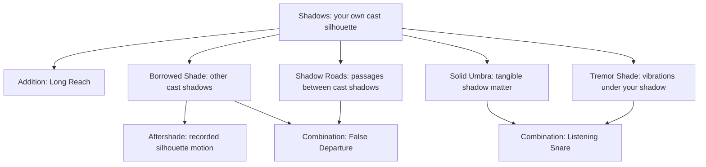

# Shadows: from street trickster to keeper of the night roads

[Starting Shadows set](../domains/shadows.md) · [Domain Combat](../README.md)

Use the [base record formats and advancement ledger](../templates.md) to turn these proposals into a character's approved abilities.

**Status:** optional development example for the standalone Domain Combat draft. This is one imagined player's campaign, not a played session report or a mandatory advancement track. It adds **five branch proposals, one Domain addition, and twenty-one new technique proposals** to the two starting techniques.

## How to play this journey

Start with Shadows, Crooked Silhouette, and Shadow Script. All later developments require the player and GM to agree on the fictional requirements, permissions, and PP price before commitment. Buying a branch permits improvisation; buying a Mastered technique is separate. The sequence below is a worked route, not a level system. A player can stop, specialize, or pursue a different seed.

All Domains and branches use **Origin: Internal Energy**. The records below describe proposed Mastered techniques: **I/M** gives base Energy cost when improvised / mastered. Count each listed Expression application once. Upkeep, exceptional costs, numerical strength, damage, PP prices, and branch coexistence limits remain unresolved in the parent module; agree on these before play. The late route assumes the GM allows all five branches to coexist. Unlocks grant no free Energy or Strain recovery.

All techniques follow **Expressions : Form : Flow : Shape : Size : Range**. Their methods state the geometry. A mastery benefit applies only after purchase and cannot grant a new permission. Activation, active steering, and responses to meaningful threats normally take a Major Action; passive maintenance follows the module's action rules. Mixing several Domains still uses one coherent action and satisfies every Anchor.

## The player's route

Mira begins as a messenger with a hooded lantern, ordinary chalk, and a shadow that can lie better than she can. Her useful equipment can be lost, occupied, or broken. It grants no supernatural permissions.

| Chapter | What happens at the table | Player's next investment |
|---|---|---|
| 1. A shadow with bad manners | A guard follows a false silhouette; another looks directly at Mira and spots her. | Master better timing and signals within starting permissions. |
| 2. The long wall | Mira cannot signal allies across a courtyard. She experiments with low lamps and uninterrupted walls. | Purchase the Long Reach addition; master a longer signal. |
| 3. Someone else's silhouette | A moving sentry breaks her carefully staged deception. She asks to work with his shadow directly. | Awaken Borrowed Shade; learn to distort an external shadow. |
| 4. The thing that cannot catch | A falling beam passes through her shadow. Training with suspended weights turns that failure into a branch seed. | Awaken Solid Umbra; learn restraint, protection, and tools. |
| 5. Every dark patch is not a door | Mira tries to cross a gap through shade and learns that a silhouette contains no travel permission. | Study and awaken Shadow Roads, then practice safe routes. |
| 6. The occupied lantern hand | An ambush arrives from behind while Mira watches her bridge. She needs information, not another attack. | Awaken Tremor Shade through experiments with footsteps on cloth and stone. |
| 7. The witness who has gone | A useful signal disappears before allies arrive. Mira wants a limited record of an actual event. | Awaken Aftershade; learn deliberate capture and replay. |
| 8. The keeper's trial | A rescue forces her to choose between holding a defence, signalling an ally, and taking a road herself. | Master two combinations and choose a campaign role. |

Each chapter below names a setback and a breakthrough. These are prompts for scenes: neither injury nor failure automatically awards a branch, and a failed experiment does not erase previous learning.

## Branch map

Beyond the starting Shadows Domain, each addition or branch box is a separate permission purchase. The two combinations are technique purchases using already owned branches. Branches do not inherit Long Reach or one another's improvements.

## 1. Learn what a shadow can already do

> “I can't disappear. Can I make the guard look at the wrong doorway?”

Mira first improvises rather than buying new powers. Her own shadow can already stretch and change outline. A lantern and a wall provide the scene; a visible body, suspicious observer, or second light can spoil the deception. She practices with a friend who deliberately refuses to follow the obvious distraction.

**Breakthrough:** Make a false signal useful while the actual body stays behind ordinary cover. Master whichever of these applications the campaign rewards; no new branch is needed.

### 1. Late Footfall

**Keywords:** Extend + Distort : Veil : Sustain : Coating : Person-sized : Close / Room  
**Access / I/M:** Starting Shadows; **2/1**.

**Method / output:** Stretch a connected silhouette onto one wall and alter its outline to suggest a person stepping past a doorway. The moving outline distracts someone watching that wall; it makes no sound and does not compel a response.

**Mastery benefit:** Repeat one practiced walking rhythm while Mira makes small ordinary movements behind cover.

**Conditions / interruption:** A contrasting surface, useful light, and uninterrupted connection. A direct view of Mira exposes the trick; severing the cast connection ends it. **Aftermath:** The shadow returns to normal; observers remember what they saw.

### 2. Blind Corner Sign

**Keywords:** Extend + Distort : Shape : Sustain : Coating : Palm-sized : Close / Room  
**Access / I/M:** Starting Shadows; **2/1**.

**Method / output:** Run a thin connected shadow along a continuous floor and up a wall around a corner, ending in one palm-sized prearranged symbol. Mira sends information she already knows; she receives no view around the corner.

**Mastery benefit:** Switch cleanly between three practiced signals without the lettering becoming ambiguous.

**Conditions / interruption:** The full route must support a continuous cast extension within Close. Broken surfaces or disrupted lighting sever it. **Aftermath:** No sign remains.

### 3. Too Many Knives

**Keywords:** Distort : Veil : Sustain : Coating : Person-sized : Close / Room  
**Access / I/M:** Starting Shadows; **1/1**.

**Method / output:** Alter the outline of Mira's existing nearby silhouette to suggest a drawn weapon or a raised second arm. It can mislead someone judging her readiness from her shadow.

**Mastery benefit:** Keep one chosen false weapon outline stable as the actual hand changes grip.

**Conditions / interruption:** The actual silhouette must fall within Close; this technique does not Extend it. Direct sight can disprove the deception; loss of the Anchor ends it. **Aftermath:** No weapon exists and nothing is injured by the silhouette.

## 2. Buy reach when reach is the missing permission

> “Same message. Longer wall. What exactly do I need to change?”

**Long Reach — Anchor growth, Shadows only.** Following practice across a courtyard, purchase one change: Shadows' maximum continuous surface connection increases from **Close / Room to Far / Hallway**. Its start condition, light requirement, Aspect, Expressions, and every other restriction remain. No detached shadows, larger default areas, or new branch ranges are included. The bodily mark may stretch into longer lines; this is cosmetic.

Old Mastered techniques retain their recorded ranges until separately improved. This new technique uses the addition immediately once acquired.

### 4. Rooftop Semaphore

**Keywords:** Extend + Distort : Shape : Sustain : Coating : Person-sized : Far / Hallway  
**Access / I/M:** Shadows with Long Reach; **2/1**.

**Method / output:** Extend a narrow connected trace along a continuous surface route to a distant wall, then shape a person-sized signal at its end. The entire route remains within Far; this cannot jump the gaps between separate rooftops.

**Mastery benefit:** Preserve one practiced symbol across a single visible wall seam or bend where a receiving surface and shadow connection remain continuous.

**Conditions / interruption:** Mira must establish a usable route and lighting. A bright interruption that removes the connected shadow breaks transmission. **Aftermath:** The display disappears; it leaves no permanent message.

## 3. Branch: Borrowed Shade

> “The sentry moves. Can his own shadow carry the lie?”

- **Parent:** Shadows.
- **Aspect:** Existing cast shadows of external creatures or objects, excluding Mira's own.
- **Connection:** She learns to manipulate the same phenomenon when another body supplies the silhouette.
- **Expressions:** Extend stretches the selected shadow while attached to its caster; Distort changes its surface outline.
- **Anchor:** Visually select one actual cast shadow within Close / Room. Maintain direct sight of that shadow, its connection to its caster, and range. Only one external shadow is selected at a time.
- **Boundary:** Cannot move, restrain, injure, read, or control the caster. Cannot create darkness or target a mere dark stain. Moving light or caster can break the selection. Natural shadows return when control ends.
- **Separation:** Starting Shadows still controls only Mira's own cast shadows. Borrowed Shade does not inherit Long Reach.
- **Awakening:** With a consenting moving partner, repeatedly alter the partner's silhouette without mistaking it for her own or losing the cast connection; finalize the branch with the GM and spend PP.
- **Mark:** A second contour appears around the eyes while selecting a shadow; it grants no special vision.

**Setback:** A sentry steps behind a pillar. The selection ends even though Mira remembers where he went. Her next experiments focus on timing, not tracking through walls.

### 5. Empty-Handed Lie

**Keywords:** Distort : Veil : Sustain : Coating : Person-sized : Close / Room  
**Access / I/M:** Borrowed Shade; **1/1**.

**Method / output:** Remove the outline of a held weapon from one selected person's silhouette, misleading an observer who relies on that shadow.

**Mastery benefit:** Preserve the false empty-hand outline through ordinary changes of the caster's weapon grip.

**Conditions / interruption:** Direct sight of the selected shadow and an intact branch Anchor. Seeing the weapon defeats the trick. **Aftermath:** The natural weapon shadow returns; the actual weapon was never hidden or altered.

### 6. Wrong Door

**Keywords:** Extend + Distort : Veil : Sustain : Coating : Person-sized : Close / Room  
**Access / I/M:** Borrowed Shade; **2/1**.

**Method / output:** Stretch a selected creature's connected shadow toward a different doorway on the same surface route and reshape its end into a leaning figure. It suggests attention or movement in the wrong direction.

**Mastery benefit:** Keep the false figure readable through one ordinary change in the caster's posture.

**Conditions / interruption:** The shadow, misleading figure, and connected route stay within Close and the selection stays visible. The caster's real movement may break the setup. **Aftermath:** The false figure disappears; the creature is never displaced.

### 7. Banner Without Cloth

**Keywords:** Extend + Distort : Shape : Sustain : Coating : Person-sized : Close / Room  
**Access / I/M:** Borrowed Shade; **2/1**.

**Method / output:** Select a fixed object's cast shadow and stretch its connected edge into a large arrow on a nearby floor. Allies can follow the sign while Mira's own body is poorly positioned to cast it.

**Mastery benefit:** Keep the arrow legible over one visible shallow step along the continuous receiving surface.

**Conditions / interruption:** The selected object supplies a real shadow; Mira maintains sight and range. Moving the object or losing the light can break it. **Aftermath:** No marking remains.

## 4. Branch: Solid Umbra

> “This time I need the shadow to catch something.”

- **Parent:** Shadows.
- **Aspect:** Tangible umbra generated from Mira's own connected cast shadow.
- **Connection:** A surface silhouette becomes the base of a new, force-bearing manifestation.
- **Expressions:** Generate creates umbra along that shadow; Shape arranges and bends it into simple continuous structures.
- **Anchor:** Mira's body interrupts a visible light source, producing a continuous shadow route on surfaces within Close. Umbra stays physically rooted to that route and rises no farther than Melee / Reach from its base.
- **Boundary:** Umbra is opaque, tangible, and of finite agreed strength. It cannot appear inside occupied matter, detach as ammunition, cut merely because it is dark, or become machinery or living creatures. It vanishes when supply or its connected Anchor ends. It grants no immunity to impact or collapse.
- **Separation:** Ordinary Shadows remains intangible. Solid Umbra does not gain Extend or Distort: reposition Mira or use a separate Shadows technique when a stretched base is needed.
- **Awakening:** Study load distribution, then repeatedly hold and safely release a suspended practice weight without a light shift collapsing the support; agree on strength and spend PP.
- **Mark:** The skin's dark tracery appears filled with opaque bands while generating umbra.

**Setback:** A broad shield collapses under a load a narrow brace held. Shape and size do not guarantee equal strength. Mira records the approved load or protection of each technique before relying on it.

### 8. Ankle Loom

**Keywords:** Generate + Shape : Bind : Sustain : Custom (low loop) : Palm-sized : Close / Room  
**Access / I/M:** Solid Umbra; **2/1**.

**Method / output:** Raise one palm-thick loop from Mira's connected shadow beside an exposed ankle, then close it around the ankle with room to resist. Its aperture fits one ankle; it attempts physical restraint at agreed strength, not paralysis through shadow sympathy.

**Mastery benefit:** A practiced yielding hinge accommodates small ankle turns without losing the loop's shape.

**Conditions / interruption:** The base must already reach the target; a separate extension, if needed, has its own cost and action demand. The target may evade, overpower, or break the loop. Broken light connection ends it. **Aftermath:** Umbra vanishes; any fall or displacement remains.

### 9. Night Brace

**Keywords:** Generate + Shape : Ward : Sustain : Wall : Person-sized : Melee / Reach  
**Access / I/M:** Solid Umbra; **2/1**.

**Method / output:** Raise a person-high, person-wide curved plate from Mira's natural nearby shadow, with a broad connected foot. It interposes physical cover from one direction at its recorded strength.

**Mastery benefit:** Form a small viewing slit without destabilizing the practiced brace. Attacks that fit the slit can still pass through it.

**Conditions / interruption:** A load-bearing surface and a shadow base outside the plate's own light obstruction are necessary. Flanking bypasses the plate; overload or loss of the base defeats it. **Aftermath:** The plate vanishes and unsupported loads fall normally.

### 10. Gloam Handrail

**Keywords:** Generate + Shape : Shape : Sustain : Custom (handrail) : Melee-sized : Melee / Reach  
**Access / I/M:** Solid Umbra; **2/1**.

**Method / output:** Shape a hand-thick rail along up to Melee length of an existing ledge within Reach. Connected supports root into Mira's shadow on the ledge; the rail helps ordinary climbing at an agreed load.

**Mastery benefit:** Maintain a practiced textured grip when rain makes the surrounding ledge slippery.

**Conditions / interruption:** The ledge must carry the shadow continuously. The rail does not span an unsupported chasm or move its user. Overload or a broken Anchor removes support. **Aftermath:** The rail vanishes; climbers need another hold.

## 5. Branch: Shadow Roads

> “I can draw the route. Now I want to walk it.”

- **Parent:** Shadows.
- **Aspect:** Brief passages linking two existing cast-shadow patches on surfaces.
- **Connection:** Practice with connected shadow routes suggests a new spatial subject; travel is an explicit new permission.
- **Expressions:** Link establishes a passage between two valid patches; Traverse moves Mira and her normally carried, nonliving equipment through it.
- **Anchor:** Mira stands touching the entry patch and directly sees the exit patch within Close / Room. Both patches must be large enough for her standing footprint, have identifiable physical casters and visible light sources, and remain cast until traversal resolves.
- **Boundary:** Only Mira travels. No passengers, attacks sent through the passage, storage, intermediate hiding, or travel to a remembered destination. A clear ordinary body-sized route no longer than Close must connect the endpoints; walls, locked doors, and gaps she could not ordinarily cross interrupt it. Travel shortens exposure along a passable route; it does not cross barriers. Exit space must be unoccupied and support her weight.
- **Separation:** Shadows cannot move a body. Roads cannot generate, extend, or reshape either endpoint and do not inherit Long Reach. Total darkness supplies no valid cast patches.
- **Awakening:** Map real routes through a lit practice room, establish a repeatable empty Link, and demonstrate a short safe Traverse under agreed risks; finalize and purchase the branch.
- **Mark:** Dark arcs appear around the soles while establishing the entry.

**Setback:** A lantern turns away just before Mira departs. The attempt fails and spends its execution Energy. If an endpoint breaks before completed traversal, she remains at entry; once completed, she is at exit. The road never strands someone in an undefined dimension.

### 11. Gloam Step

**Keywords:** Link + Traverse : Shift : Burst : Custom (two footprints) : Person-sized : Close / Room  
**Access / I/M:** Shadow Roads; **2/1**.

**Method / output:** Link two valid patches and traverse once, moving Mira up to Close along the branch's allowed route. The Size describes the traveler, not an affected room.

**Mastery benefit:** Arrive facing a declared direction with stable footing on an ordinary level exit.

**Conditions / interruption:** Both endpoints, visible exit, clear route, and free landing space must hold until resolution. This answers only threats the relocation plausibly avoids. **Aftermath:** Mira and her carried gear remain at exit; the Link closes immediately.

### 12. Under the Gallows

**Keywords:** Link + Traverse : Shift : Burst : Custom (two footprints) : Person-sized : Melee / Reach  
**Access / I/M:** Shadow Roads; **2/1**.

**Method / output:** Traverse between two valid nearby patches, crossing at most Melee distance into a crouch behind existing cover. There must be an ordinary traversable route around the cover.

**Mastery benefit:** Arrive in a practiced low stance without needing a separate posture adjustment. This neither creates cover nor makes Mira unseen to an observer watching the exit.

**Conditions / interruption:** The exit accommodates the crouched body; all Road conditions apply. Obstructing the route before completion spoils the move. **Aftermath:** The Link closes; Mira must respond normally to threats at the exit.

### 13. Homeward Feint

**Keywords:** Link + Traverse : Shift : Burst : Custom (two footprints) : Person-sized : Close / Room  
**Access / I/M:** Shadow Roads; **2/1**.

**Method / output:** Withdraw to one currently visible valid patch checked earlier in the scene, moving up to Close. The earlier check is preparation, not an enduring magical mark or stored Link.

**Mastery benefit:** Retain a practiced guard with a held item on arrival; this does not provide a free attack or defence.

**Conditions / interruption:** Recheck current light, route, range, and occupancy. A changed destination can invalidate the move. **Aftermath:** One relocation, no automatic return journey, and no open portal.

## 6. Branch: Tremor Shade

> “I don't need to see the attacker. I need to know that this strip of floor was crossed.”

- **Parent:** Shadows.
- **Aspect:** Mechanical vibrations in a solid surface immediately beneath Mira's own connected cast shadow.
- **Connection:** She learns to use the shadow's surface contact as a coupling to a different phenomenon.
- **Expressions:** Sense detects current vibrations beneath the selected footprint; Filter distinguishes a declared pattern or excludes a known background vibration.
- **Anchor:** A bare palm or sole touches the same continuous solid surface carrying her own cast shadow. Select one shadow-covered patch within Close, no wider than Person-sized; maintain contact, the cast connection, and the surface route.
- **Boundary:** No vision, identities, thoughts, future events, or detection through disconnected surfaces. Only vibrations arriving beneath the patch can be sensed. Flying, extremely quiet movement, soft coverings, and noisy machinery may defeat useful interpretation. No amplification or movement of matter.
- **Separation:** Starting Shadows gains no senses. Tremor Shade cannot extend its sensing footprint; arranging an extended base requires separate Shadows use.
- **Awakening:** Blind trials with walking partners, dropped weights, and false positives establish repeatable detection and its limits; approve and purchase the branch.
- **Mark:** Fine rings pulse around the contacting palm or sole; they do not supply a second sense by themselves.

**Setback:** A wagon's vibration resembles rushing footsteps. Mira learns to declare what she filters and accept uncertainty rather than naming every distant creature.

### 14. Threshold Ear

**Keywords:** Sense + Filter : Ward : Sustain : Coating : Person-sized : Close / Room  
**Access / I/M:** Tremor Shade; **2/1**.

**Method / output:** Monitor one shadow-covered strip across a doorway, at most a person's height in length and a palm in width, filtering for footstep-like impacts. It provides warning when detectable vibrations reach the strip, not an automatic defensive action.

**Mastery benefit:** Distinguish the order of two clearly separated impacts within the monitored patch.

**Conditions / interruption:** Maintain bare contact, shadow, and continuous surface. Soft steps or background noise can obscure the signal; breaking the Anchor ends monitoring. **Aftermath:** Only Mira's ordinary recollection remains.

### 15. Find the Running Beat

**Keywords:** Sense + Filter : Shape : Sustain : Coating : Person-sized : Melee / Reach  
**Access / I/M:** Tremor Shade; **2/1**.

**Method / output:** Organize vibrations beneath a person-sized patch of nearby shadow into a perceived rhythm while excluding one already observed repetitive source, such as a pump. Mira can report a remaining cadence or that nothing is distinguishable.

**Mastery benefit:** Retain the pump filter through small ordinary fluctuations in its rhythm.

**Conditions / interruption:** Mira must first sample the background source. Overlapping rhythms can remain ambiguous. Loss of surface contact or shadow stops perception. **Aftermath:** No stored recording or knowledge of the source's identity.

### 16. Fingers on the Stair

**Keywords:** Sense : Ward : Sustain : Coating : Palm-sized : Self / Touch  
**Access / I/M:** Tremor Shade; **1/1**.

**Method / output:** Touch one shadow-covered stair tread and sense present vibrations directly beneath a palm-sized patch, watching for a distinct impact during a retreat.

**Mastery benefit:** Recognize the timing of one practiced ally's deliberately tapped signal amid otherwise distinguishable impacts. Another person can imitate it; this is not identity detection.

**Conditions / interruption:** Actual vibration must reach the selected tread. Disconnected construction, noise, or broken contact defeats the use. **Aftermath:** No alarm persists after Mira leaves.

## 7. Branch: Aftershade

> “Can the shadow repeat what actually happened here?”

- **Parent:** Borrowed Shade.
- **Aspect:** A transient recorded sequence of one external caster's silhouette motion.
- **Connection:** Repeatedly matching a moving borrowed silhouette leads to capturing a bounded pattern rather than controlling the live shadow.
- **Expressions:** Capture records up to one exchange of an observed silhouette's motion; Replay displays that captured sequence as a flat shadow image, allowing pauses and changes of playback tempo without altering its content or order.
- **Anchor:** During capture, directly see one external cast shadow within Close. During replay, a bare hand touches a continuous contrasting surface, with the image within Reach of that hand. One recording is held through uninterrupted concentration until the end of the scene at most; losing concentration erases it.
- **Boundary:** Replay is person-sized or smaller, silent, flat, uncoloured, and limited to what was captured. It contains no hidden detail or unseen events, cannot be edited or enlarged beyond Person-sized, and has no physical force or awareness. Capturing again overwrites the previous sequence. Removing the hand ends the display, though the recording survives if concentration holds.
- **Separation:** Borrowed Shade cannot record or leave messages after its live Anchor ends. Aftershade's explicit projected image need not connect to the original caster, but is not a real cast shadow and cannot anchor any other branch here.
- **Awakening:** Capture a partner's short gesture and replay it accurately after the partner departs, then test interruptions and deliberate false demonstrations; approve and purchase the branch.
- **Mark:** A dark band at the temple pulses while holding a recording; fingertips darken during replay.

**Setback:** Mira records a shadow already distorted by another user. The playback faithfully repeats the deception. A silhouette is evidence of an appearance, not proof of the underlying event.

Capture uses a normal paid **Capture improvisation (1 Energy)** with its own action demand before these Replay techniques. It is a temporary pattern, not an Energy reservoir or an Accumulate effect. Pattern retention and sustained playback costs remain to be agreed; their separation does not make retention free. None of the following techniques includes a free Capture.

### 17. Witness Loop

**Keywords:** Replay : Shape : Sustain : Coating : Person-sized : Melee / Reach  
**Access / I/M:** Aftershade with a held recording; **1/1**, plus prior Capture.

**Method / output:** Repeatedly show the captured sequence on one person-sized wall patch within Reach of the touching hand. Observers can inspect the visible silhouette motion.

**Mastery benefit:** Pause at one chosen recorded posture and resume from that point without changing the sequence.

**Conditions / interruption:** A contrasting surface, hand contact, and retained recording. Light can wash out the image. Broken contact ends display; broken concentration erases the recording. **Aftermath:** No permanent evidence remains unless someone makes an ordinary independent record.

### 18. The Watchman Remains

**Keywords:** Replay : Veil : Sustain : Coating : Person-sized : Melee / Reach  
**Access / I/M:** Aftershade with a held recording; **1/1**, plus prior Capture.

**Method / output:** Replay a previously captured watchman's idle silhouette on a wall while Mira keeps her touching hand behind ordinary cover. It suggests that the watchman is still nearby to someone relying on the image.

**Mastery benefit:** Loop a practiced sequence whose captured beginning and end match, avoiding a visible reset jerk.

**Conditions / interruption:** The recording must suit the wall and light. The image does not respond to questions or new events. All replay Anchor conditions apply. **Aftermath:** The image vanishes; no independent guard remains.

### 19. Follow My Hands

**Keywords:** Replay : Shape : Sustain : Coating : Palm-sized : Melee / Reach  
**Access / I/M:** Aftershade with a held recording; **1/1**, plus prior Capture.

**Method / output:** Display a captured hand silhouette demonstrating a short signal sequence on a palm-sized patch. Capture only the hand-sized subject; Replay adds no cropping or editing permission.

**Mastery benefit:** Replay the gestures at a practiced slower tempo while preserving their order and shapes.

**Conditions / interruption:** A legible original capture, hand contact, and concentration. The display cannot teach details absent from the silhouette. **Aftermath:** Learners may remember the signal; no automatic skill or mastery is granted.

## 8. Combine what you earned

> “I have enough powers. Which ones actually solve this problem together?”

### 20. Listening Snare

**Keywords:** Solid Umbra—Generate + Shape + Tremor Shade—Sense + Filter : Bind : Sustain : Custom (sensing loop) : Palm-sized : Melee / Reach  
**Access / I/M:** Solid Umbra and Tremor Shade; **4/2**.

**Method / output:** From a nearby patch of Mira's own natural shadow, form an open palm-thick ankle loop and monitor vibrations immediately beneath it. While actively attending, Mira closes the loop when a declared footstep-like impact reaches the patch. This is one locally monitored restraint, not an autonomous trap or a second attack.

**Mastery benefit:** Distinguish a withdrawal impact from a fresh arrival when the two vibrations are clear, improving the timing of the loop's same closing attempt.

**Conditions / interruption:** Both Anchors hold, including Mira's bare contact with the receiving surface. Closure is part of the declared Major Action; leaving it open does not grant a later free reaction. Targets can avoid or overpower it. Losing Tremor Shade removes sensing; losing Solid Umbra removes the loop. **Aftermath:** No unattended trap remains; existing displacement remains.

### 21. False Departure

**Keywords:** Borrowed Shade—Extend + Distort + Shadow Roads—Link + Traverse : Shift : Burst : Custom (false silhouette and two footprints) : Person-sized : Close / Room  
**Access / I/M:** Borrowed Shade and Shadow Roads; **4/2**.

**Method / output:** Borrow one external object's visible shadow, stretching its connected edge into a person-shaped false departure on a nearby wall during a single relocation between separate, valid Road endpoints. The false silhouette is at most person-sized; Mira and her gear are the only traveler, moving at most Close. All components stay within Close and their distinct surface routes remain valid.

**Mastery benefit:** Match the silhouette's first apparent step to the instant of departure, making the practiced distraction more convincing to a shadow-watching observer.

**Conditions / interruption:** Both Anchors must hold through departure. The borrowed shadow is not either Road endpoint. This momentary Burst gains no lingering silhouette, extra move, free attack, or automatic evasion. An observer watching the true exit can still see Mira. **Aftermath:** Borrowed distortion returns to normal immediately; the Link closes and Mira remains at exit.

## The keeper's trial: one scene, several real choices

A companion is pinned beneath a fallen gate in a lamp-lit depot. A patrol approaches over a stone floor. A rotating searchlight sweeps the walls. Mira's objective is to help the companion escape; defeating the patrol is optional.

1. **Read the scene.** Identify casters, lights, actual shadow connections, exit occupancy, and passable routes. Chalk and the lantern help plan; neither cancels the searchlight.
2. **Choose a first commitment.** Night Brace may hold a load only if its approved strength supports this gate. Threshold Ear can monitor an approaching route but cannot lift the gate. Mira declares one Major Action; an ally can supply the other contribution.
3. **Let the weakness matter.** The moving searchlight breaks the chosen base unless someone changes the physical lighting or Mira establishes another valid one in time. Merely renaming the technique does not preserve it.
4. **Coordinate the rescue.** Allies free and move the companion while Mira supports or distracts. Shadow Roads cannot carry the companion, even when that would be convenient. Any ordinary dragging follows ordinary action and movement limits.
5. **Take an earned exit.** False Departure can help Mira leave after her support is no longer needed. Its exit must still be visible, clear, and physically reachable by an ordinary route. She cannot maintain a necessary nearby brace from an incompatible position for free.
6. **Debrief.** Record the failed assumption, the successful improvisation, and the next desired purchase. If the player now wants passenger travel, negotiate that precise addition to Traverse and its changed restrictions before spending PP.

Roll when uncertainty and consequences matter, using the eventual agreed Domain Combat resolution procedure. Establish the threat before the roll. No dice threshold, damage value, or guaranteed success is supplied by this example.

## What the character sheet looks like afterward

This is a menu accumulated over a long campaign, not a reward bundle from completing eight scenes. On the fully developed example sheet:

- **Original Domain:** Shadows, with Extend and Distort, plus the separately purchased Long Reach Anchor addition.
- **Branches:** Borrowed Shade, Solid Umbra, Shadow Roads, Tremor Shade, and Aftershade, each retaining its own Aspect, two Expressions, Anchor, and limits.
- **Techniques:** Two free starting Mastered choices; up to twenty-one later Mastered purchases if the player buys the entire catalogue. Other permitted uses remain improvisations at their normal Expression cost.
- **Identity:** A scout, deceiver, and rescue specialist who depends on actual lighting, routes, support surfaces, and allies.

| If the player enjoys… | Prioritize | Accept the tradeoff |
|---|---|---|
| Misdirection and social infiltration | Shadows → Borrowed Shade → Aftershade | No solid defence; direct observation can defeat a shadow lie. |
| Holding ground and rescuing allies | Shadows → Solid Umbra → Tremor Shade | Needs stable surfaces, light, and attention; loads have finite limits. |
| Mobile scouting and escapes | Shadows → Shadow Roads, with Borrowed Shade later | Travels alone over valid routes; cannot bypass sealed barriers. |

For each real purchase, keep a short ledger: **scene evidence → missing permission → agreed development → PP price → purchase → separately mastered technique**. Keep numerical balance questions in the standalone module until settled. Further seeds such as passenger roads, detached constructs, or true darkness generation remain future negotiations, not hidden abilities on this sheet.
